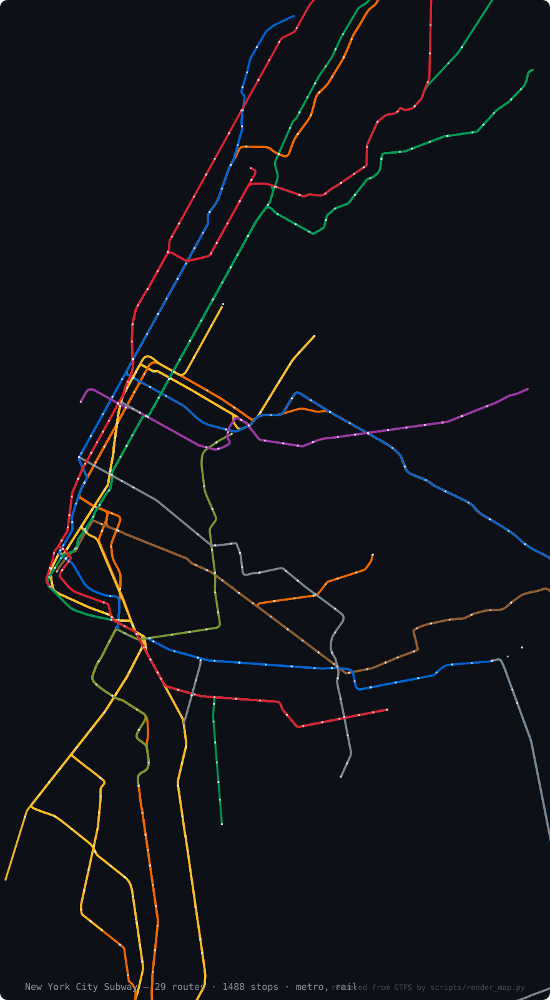
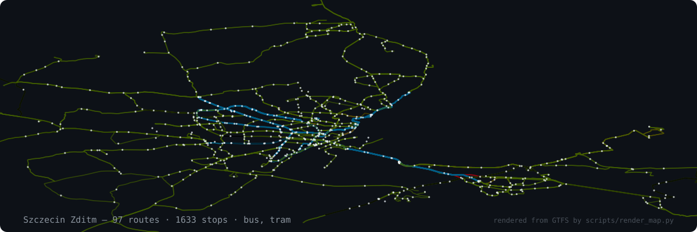
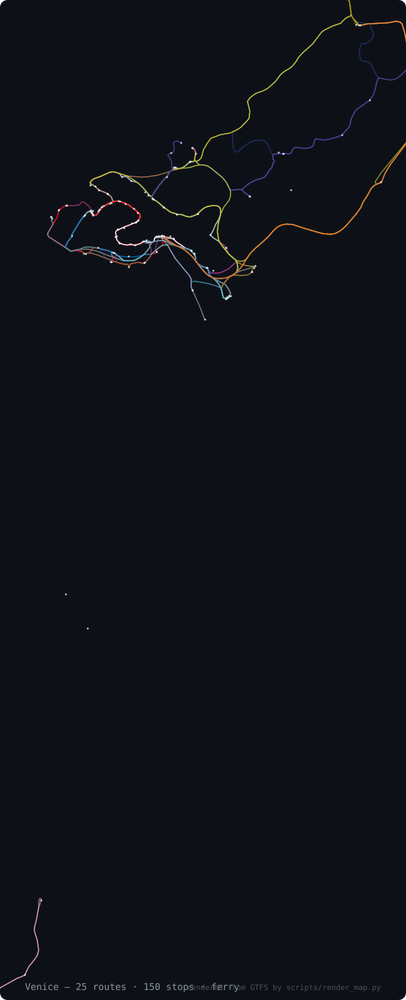
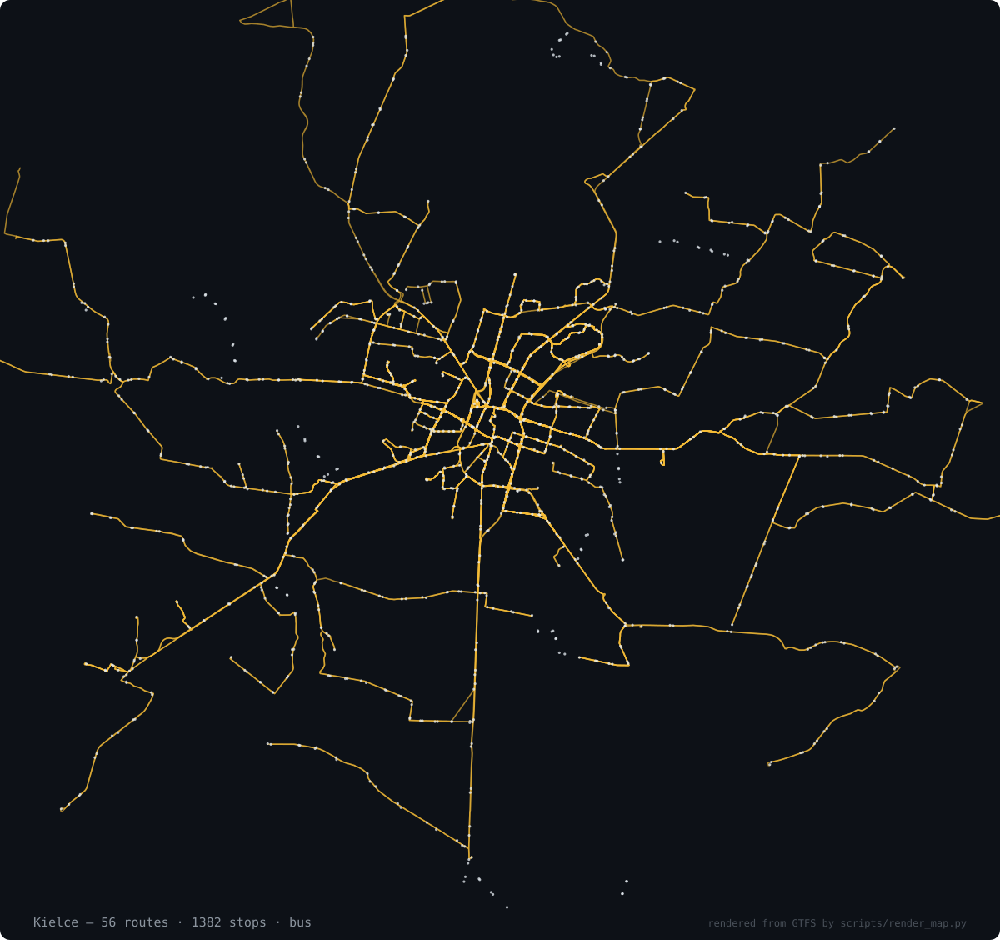
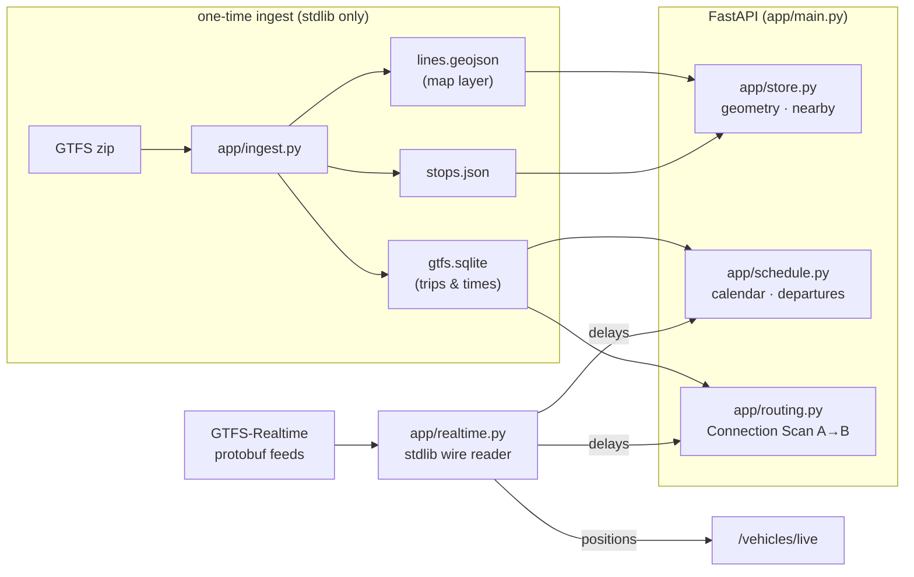

# 🚇 City Transit API

**A keyless FastAPI backend for city public transport.** It turns official
**GTFS** feeds into map-ready line geometry + stops, plans door-to-door city
journeys (walk → ride → transfer → ride → walk) with a stdlib router, and
overlays **live** vehicle positions and delays where a city publishes
GTFS-Realtime. No API keys. No database. Artifacts are flat files.

<p>
  
  
  
  
  
  
</p>

> **Public transport only** — city trams, buses, metro, urban & national rail.
> Verified live **2026-07-22**. Re-check any time:
> `python3 scripts/feeds_status.py`.

<p align="center">
  
</p>
<p align="center"><sub>
  Vienna — 694 routes, 4 259 stops, drawn by this repo from its own ingested
  data (U-Bahn in official line colors over the bus/tram grid). Pulled from the
  world catalog and rendered with two commands:
  <code>python -m app.ingest mdb-648 && python3 scripts/render_map.py mdb-648</code>.
  No map tiles, no external services.
</sub></p>

|  |  |
|:---:|:---:|
| **NYC Subway** — every line in its official MTA color | **Szczecin** — trams (blue) over the bus grid, live GTFS-RT |
|  |  |
| **Venice** — vaporetto ferries: Canal Grande, Lido, Burano | **Kielce** — 56 bus routes, per-route feed colors |

```bash
python3 scripts/render_map.py <feed-id>      # re-draw any ingested city
```

---

## 🚦 Curated feed status — what works & what doesn't

GTFS feeds are the *only* external dependency here, so "checking the APIs"
means checking the feeds. The 18 hand-verified feeds below are live-checked with
[`scripts/feeds_status.py`](scripts/feeds_status.py); the 1484-feed world
catalog is covered in the **Coverage** section below.
✅ = HTTP 200 · ➖ = needs a provider key · ❌ = down.

| City | Country | Static GTFS | Realtime | Status |
|---|---|---|:---:|:---:|
| **Szczecin** (ZDiTM) | 🇵🇱 PL | 3.9 MB | 📡 vehicles + trips + alerts | ✅ |
| **Warszawa** (ZTM) | 🇵🇱 PL | 100 MB | — | ✅ |
| **GZM / Katowice** (Silesia) | 🇵🇱 PL | 44 MB | — | ✅ |
| **Bydgoszcz** | 🇵🇱 PL | 2.5 MB | — | ✅ |
| **Toruń** | 🇵🇱 PL | 2.0 MB | — | ✅ |
| **Rzeszów** | 🇵🇱 PL | 3.9 MB | — | ✅ |
| **Lublin** | 🇵🇱 PL | 5.6 MB | — | ✅ |
| **Radom** | 🇵🇱 PL | 2.4 MB | — | ✅ |
| **Kielce** | 🇵🇱 PL | 7.9 MB | — | ✅ |
| **PKP** (national rail) | 🇵🇱 PL | 28 MB | — | ✅ |
| **Berlin / Brandenburg** (VBB) | 🇩🇪 DE | 75 MB | — | ✅ |
| **DB long-distance** | 🇩🇪 DE | 0.4 MB | — | ✅ |
| **DB regional rail** | 🇩🇪 DE | 10 MB | — | ✅ |
| **New York City Subway** (MTA) | 🇺🇸 US | 5.6 MB | — | ✅ |
| **Boston** (MBTA) | 🇺🇸 US | 18 MB | — | ✅ |
| **Portland, OR** (TriMet) | 🇺🇸 US | 38 MB | — | ✅ |
| **Chicago** (CTA) | 🇺🇸 US | 68 MB | — | ✅ |
| **Bay Area** (511) | 🇺🇸 US | — | — | ➖ needs 511 key |

**17 / 18 feeds live · 3 countries · 15 cities + 3 rail networks.**

```bash
python3 scripts/feeds_status.py     # prints this table, live, per city
```

Add a city by registering a verified `gtfs_static_url` in
[`feeds.json`](feeds.json) and running `python -m app.ingest <id>`.
**Don't invent feed URLs** — only add ones you've confirmed.

---

## 🌍 Coverage — 1484 feeds · 71 countries

Two registries feed the API:

- **[`feeds.json`](feeds.json)** — 18 hand-verified feeds (PL / DE / US) with
  realtime URLs, timezones and ingest notes. Curated, tested, documented above.
- **[`feeds_world.json`](feeds_world.json)** — **1 484 keyless GTFS feeds in
  71 countries**, imported from the official
  [MobilityData catalog](https://mobilitydatabase.org) (the registry behind
  Transitland/Google's transit ecosystem, ~2 400 GTFS feeds across 83
  countries). Only feeds with a **direct, no-API-key download** are kept, and
  downloads prefer MobilityData's stable `latest` mirror so links don't rot.

| Region | Keyless feeds |
|---|---|
| 🇺🇸 US 816 · 🇨🇦 CA 108 | North America **924** |
| 🇫🇷 FR 83 · 🇩🇪 DE 43 · 🇬🇧 GB 42 · 🇮🇹 IT 41 · 🇵🇱 PL 37 · 🇪🇸 ES 36 · 🇫🇮 FI 19 · 🇷🇴 RO 18 · 🇵🇹 PT 17 + 25 more | Europe **~430** |
| 🇦🇺 AU 33 · 🇮🇳 IN 13 · 🇧🇷 BR 10 · 🇯🇵 · 🇳🇿 · 🇨🇮 · 🇲🇽 … | Rest of world **~130** |

Any of them ingests by id, exactly like a curated feed:

```bash
python3 scripts/import_catalog.py            # refresh the world registry
python3 scripts/import_catalog.py --verify 30  # + live-check a random sample
python -m app.ingest mdb-648                 # Vienna — the map above
python -m app.ingest mdb-1063                # Venice vaporetti
```

<sub>Sample health at import time: 28/30 random feeds reachable (93 %).
Catalog feeds that need a provider API key (e.g. Bay Area 511) are excluded
from `feeds_world.json` by design.</sub>

---

## 🔌 Endpoints

| Endpoint | Purpose |
|---|---|
| `GET /health` | Liveness + which feeds are ingested |
| `GET /cities` | Ingested cities + center coords (map picker) |
| `GET /routes?city=` | Routes in a city (filter by `mode`) |
| `GET /routes/{city}/{route_id}/geometry` | One route's line as GeoJSON |
| `GET /routes/{city}/{route_id}/stops` | Ordered stops of a route/direction |
| `GET /map/layers?city=` | What to draw + where to fetch it |
| `GET /map/{city}/lines.geojson` | Full line layer for the map |
| `GET /stops?city=` · `/stops/nearby` · `/stops/search` | Stops (all / by radius / by name) |
| `GET /stops/{city}/{stop_id}/departures` | Next departures ("My Stop" board), live |
| `GET /journey` | **Plan A→B** — walk + rides + transfers, live delays |
| `GET /vehicles/live?city=` | Live vehicle positions (GTFS-RT feeds) |

Interactive docs at `/docs` once the server is up.

---

## 🧪 See it in action

Real responses from a running instance (Szczecin, live GTFS-RT attached).

**Plan a door-to-door journey** — walk → tram → walk, with the tram's *live*
delay already applied:

```bash
curl "localhost:8000/journey?city=szczecin-zditm&from_lat=53.428&from_lon=14.552&to_lat=53.44&to_lon=14.49"
```

```jsonc
{
  "itineraries": [{
    "depart": "2026-07-23T20:40", "arrive": "2026-07-23T21:11",
    "duration_min": 31, "transfers": 1, "walk_min": 8,
    "live": true,                       // ← realtime delays applied
    "legs": [
      { "type": "walk", "to": "Plac Rodła", "seconds": 364 },
      { "type": "ride", "mode": "tram", "route": "5", "color": "#005E85",
        "headsign": "Osiedle Zawadzkiego",
        "board": "Plac Rodła", "alight": "Krzekowo",
        "delay_sec": -2, "live": true, "num_stops": 12,
        "stops": [ { "name": "Plac Rodła", "lat": 53.4316, "lon": 14.5556 }, "…" ] },
      { "type": "walk", "to": "Destination", "seconds": 297 }
    ]
  }]
}
```

**"My Stop" departure board** — next departures with per-vehicle delays:

```bash
curl "localhost:8000/stops/szczecin-zditm/11511/departures?limit=3"
```

```jsonc
{
  "stop_name": "Plac Rodła",
  "departures": [
    { "route": "101", "mode": "bus",  "time": "20:41", "in_minutes": 0, "live": true,  "delay_sec": 25  },
    { "route": "12",  "mode": "tram", "time": "20:48", "in_minutes": 7, "live": true,  "delay_sec": 131 },
    { "route": "59",  "mode": "bus",  "time": "20:47", "in_minutes": 6, "live": false, "delay_sec": 0   }
  ]
}
```

**Live vehicle positions** — 166 vehicles on the map at query time:

```bash
curl "localhost:8000/vehicles/live?city=szczecin-zditm"
```

```jsonc
[
  { "route": "60", "mode": "bus", "lat": 53.44495, "lon": 14.53979,
    "bearing": 90.0, "headsign": "Stocznia Szczecińska", "label": "1053" },
  "… 165 more"
]
```

---

## 🧭 How it works



- **Routing** is a **Connection Scan Algorithm** over the day's GTFS
  connections — stdlib-only, an active city day scans in well under a second.
- **Realtime** parses the GTFS-RT protobuf with a tiny built-in wire reader —
  no `gtfs-realtime-bindings`, no protobuf dependency.
- **Geometry** dedupes to the longest shape per (route, direction) so the map
  draws one clean line per route, not dozens of overlapping variants.
- **Timezones:** GTFS times are local wall-clock, so departures use each feed's
  own timezone, never the server's clock.

---

## ▶️ Run

```bash
pip install -r requirements.txt        # fastapi + uvicorn, nothing else
python -m app.ingest szczecin-zditm    # download + build one city (stdlib only)
uvicorn app.main:app --reload          # → http://127.0.0.1:8000/docs
```

```bash
curl "http://127.0.0.1:8000/cities"
curl "http://127.0.0.1:8000/journey?city=szczecin-zditm&from_lat=53.428&from_lon=14.552&to_lat=53.44&to_lon=14.49"
```

No keys or config required. `data/` (ingested artifacts) is generated and
gitignored — regenerate with `app.ingest`.

---

<div align="center">

**Made by Dmytro Serohyn**

<sub>Keyless · GTFS static + realtime · 17 cities live · verified 2026-07-22</sub>

</div>
