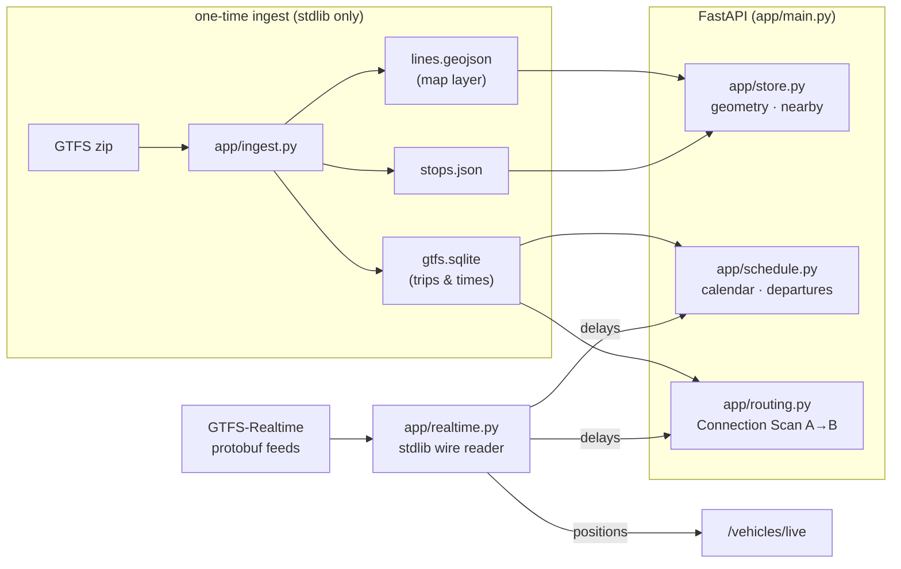

# 🚇 City Transit API

**A keyless FastAPI backend for city public transport.** It turns official
**GTFS** feeds into map-ready line geometry + stops, plans door-to-door city
journeys (walk → ride → transfer → ride → walk) with a stdlib router, and
overlays **live** vehicle positions and delays where a city publishes
GTFS-Realtime. No API keys. No external database server required — artifacts are flat files + per-city SQLite.

<p>
  <a href="https://github.com/dimaxus3-dev/public-transit-api/releases/latest"></a>
  <a href="https://github.com/dimaxus3-dev/public-transit-api/releases"></a>
  <a href="https://github.com/dimaxus3-dev/public-transit-api/pkgs/container/public-transit-api"></a>
  
  
  
  
  
  
</p>

> **Public transport only** — city trams, buses, metro, urban & national rail.
> **📊 [Live status of every city →](docs/STATUS.md)** · **🚏 [Network stats & all stops →](docs/STATS.md)** — all 1501 feeds
> measured (HTTP · latency · size), refreshed weekly by CI.
> Last full check **2026-07-24**: **1436/1501 alive (95 %), median 263 ms**.

<p align="center">
  
</p>
<p align="center"><sub>
  Vienna — 694 routes, 4 259 stops, drawn by this repo from its own ingested
  data (U-Bahn in official line colors over the bus/tram grid). Pulled from the
  world catalog and rendered with two commands:
  <code>python -m app.ingest mdb-648 && python3 scripts/render_map.py mdb-648</code>.
  No map tiles, no external services.
</sub></p>

|  |  |
|:---:|:---:|
| **NYC Subway** — every line in its official MTA color | **Szczecin** — trams (blue) over the bus grid, live GTFS-RT |
|  |  |
| **Venice** — vaporetto ferries: Canal Grande, Lido, Burano | **Kielce** — 56 bus routes, per-route feed colors |

```bash
python3 scripts/render_map.py <feed-id>      # re-draw any ingested city
```

---

## 💡 What is this and what problem does it solve?

**The problem.** Every transit agency on Earth publishes its schedules as
**GTFS** — a zip of CSV files (routes, stops, timetables) that is a *data
dump*, not an API. You can't ask a zip "when is my next tram?" or "how do I
get from A to B?". Commercial APIs that answer those questions cost money,
need API keys, and cover a fraction of cities.

**A "feed"** = one agency's GTFS package — usually one city (Kielce), sometimes
a region (Berlin-Brandenburg) or a whole national network (PKP rail). This
repo's registry knows **1500+ feeds in 71 countries**, each identified by a
short id like `nyc-subway` or `mdb-648` (Vienna).

**What this API does.** Point it at any feed id and it turns the raw zip into
things you can actually build on:

| You ask | You get |
|---|---|
| "Draw the network" | Map-ready GeoJSON lines in real route colors + all stops |
| "When's the next bus at this stop?" | A live departure board (with realtime delays where published) |
| "How do I get from A to B?" | A door-to-door journey: walk → ride → transfer → ride → walk |
| "Where are the vehicles right now?" | Live GTFS-RT positions, polled or streamed over SSE |

No API keys, no external database, no paid services — one Python process.

### 🧑‍💻 Use it in five minutes — common scenarios

**1. City transit map for a web/mobile app**

```bash
python -m app.ingest mdb-648                  # Vienna, one command
curl "localhost:8000/map/mdb-648/lines.geojson"   # draw this on MapLibre/Leaflet
curl "localhost:8000/stops/nearby?city=mdb-648&lat=48.208&lng=16.373&radius=500"
```

**2. "My stop" departure widget** (home dashboard, e-ink display, Slack bot…)

```bash
curl "localhost:8000/stops/szczecin-zditm/11511/departures?limit=5"
# → route 12 tram in 7 min (live, +131 s delay), bus 101 in 0 min …
```

**3. Door-to-door journey planner**

```bash
curl "localhost:8000/journey?city=szczecin-zditm&from_lat=53.428&from_lon=14.552&to_lat=53.44&to_lon=14.49"
# → walk 6 min → tram 5 (12 stops, live −2 s) → walk 5 min, 31 min total
```

**4. Live vehicles on a map** — one line of JS:

```js
new EventSource("/vehicles/stream?city=szczecin-zditm")
  .onmessage = e => drawMarkers(JSON.parse(e.data).vehicles);
```

**5. Research / data analysis** — every ingested city leaves clean artifacts
(`lines.geojson`, `stops.json`, `gtfs.sqlite`) you can load straight into
pandas/QGIS, plus `scripts/render_map.py` for instant network posters.

---

## 🚦 Curated feed status — what works & what doesn't

GTFS feeds are the *only* external dependency here, so "checking the APIs"
means checking the feeds. Every row below is a **real measurement** (HTTP code,
response latency, feed size) taken with
[`scripts/feeds_status.py`](scripts/feeds_status.py) on **2026-07-24**; the
1484-feed world catalog is covered in the **Coverage** section below.
✅ = HTTP 200 · ➖ = needs a provider key · ❌ = down.

| City | Country | HTTP | Latency | Size | Realtime | Status |
|---|---|:---:|---:|---:|:---:|:---:|
| **Szczecin** (ZDiTM) | 🇵🇱 PL | 200 | 985 ms | 3.9 MB | 📡 vehicles 200 · trips 200 · alerts 200 | ✅ |
| **Warszawa** (ZTM) | 🇵🇱 PL | 200 | 829 ms | 97.5 MB | — | ✅ |
| **GZM / Katowice** (Silesia) | 🇵🇱 PL | 200 | 749 ms | 44.2 MB | — | ✅ |
| **Bydgoszcz** | 🇵🇱 PL | 200 | 742 ms | 2.5 MB | — | ✅ |
| **Toruń** | 🇵🇱 PL | 200 | 817 ms | 2.0 MB | — | ✅ |
| **Rzeszów** | 🇵🇱 PL | 200 | 722 ms | 3.9 MB | — | ✅ |
| **Lublin** | 🇵🇱 PL | 200 | 877 ms | 5.6 MB | — | ✅ |
| **Radom** | 🇵🇱 PL | 200 | 1027 ms | 2.4 MB | — | ✅ |
| **Kielce** | 🇵🇱 PL | 200 | 734 ms | 7.9 MB | — | ✅ |
| **PKP** (national rail) | 🇵🇱 PL | 200 | 730 ms | 28.4 MB | — | ✅ |
| **Berlin / Brandenburg** (VBB) | 🇩🇪 DE | 200 | 2011 ms | 75.3 MB | — | ✅ |
| **DB long-distance** | 🇩🇪 DE | 200 | 2275 ms | 0.4 MB | — | ✅ |
| **DB regional rail** | 🇩🇪 DE | 200 | 721 ms | 10.4 MB | — | ✅ |
| **New York City Subway** (MTA) | 🇺🇸 US | 200 | 398 ms | 5.6 MB | — | ✅ |
| **Boston** (MBTA) | 🇺🇸 US | 200 | 144 ms | 18.1 MB | — | ✅ |
| **Portland, OR** (TriMet) | 🇺🇸 US | 200 | 257 ms | 38.3 MB | — | ✅ |
| **Chicago** (CTA) | 🇺🇸 US | 200 | 675 ms | 67.9 MB | — | ✅ |
| **Bay Area** (511) | 🇺🇸 US | — | — | — | — | ➖ needs free 511 key |

**17 / 18 static feeds live · Szczecin realtime: all 3 GTFS-RT endpoints
answering** (vehicles 17 KB, trip updates 84 KB, alerts 2 KB protobuf —
fetched in under a second each). The only non-live entry needs a free
provider key, not a fix.

```bash
python3 scripts/feeds_status.py     # prints this table, live, per city
```

Add a city by registering a verified `gtfs_static_url` in
[`feeds.json`](feeds.json) and running `python -m app.ingest <id>`.
**Don't invent feed URLs** — only add ones you've confirmed.

---

## 🌍 Coverage — 1484 feeds · 71 countries

Two registries feed the API:

- **[`feeds.json`](feeds.json)** — 18 hand-verified feeds (PL / DE / US) with
  realtime URLs, timezones and ingest notes. Curated, tested, documented above.
- **[`feeds_world.json`](feeds_world.json)** — **1 484 keyless GTFS feeds in
  71 countries**, imported from the official
  [MobilityData catalog](https://mobilitydatabase.org) (the registry behind
  Transitland/Google's transit ecosystem, ~2 400 GTFS feeds across 83
  countries). Only feeds with a **direct, no-API-key download** are kept, and
  downloads prefer MobilityData's stable `latest` mirror so links don't rot.

| Region | Keyless feeds |
|---|---|
| 🇺🇸 US 816 · 🇨🇦 CA 108 | North America **924** |
| 🇫🇷 FR 83 · 🇩🇪 DE 43 · 🇬🇧 GB 42 · 🇮🇹 IT 41 · 🇵🇱 PL 37 · 🇪🇸 ES 36 · 🇫🇮 FI 19 · 🇷🇴 RO 18 · 🇵🇹 PT 17 + 25 more | Europe **~430** |
| 🇦🇺 AU 33 · 🇮🇳 IN 13 · 🇧🇷 BR 10 · 🇯🇵 · 🇳🇿 · 🇨🇮 · 🇲🇽 … | Rest of world **~130** |

Any of them ingests by id, exactly like a curated feed:

```bash
python3 scripts/import_catalog.py            # refresh the world registry
python3 scripts/import_catalog.py --verify 30  # + live-check a random sample
python -m app.ingest mdb-648                 # Vienna — the map above
python -m app.ingest mdb-1063                # Venice vaporetti
```

**📊 [Full status page](docs/STATUS.md)** — every one of the 1501 feeds
measured individually (HTTP code, latency, size), grouped by country with
per-country health and median latency. Rebuilt every Monday by a scheduled
GitHub Action, and reproducible any time:

```bash
python3 scripts/check_all.py       # ~2 min on 80 threads, writes docs/STATUS.md
```

**🔬 [Deep check](docs/DEEP_CHECK.md)** — HTTP 200 alone proves little, so
**every single registered feed — all 1501 —** is pushed through the FULL
pipeline:

```
reachable ──▶ valid GTFS + ingested end-to-end ──▶ routable today
1436/1501              1387/1501 (92 %)             751/1501 (50 %)
```

`ingested` proves download → zip validation → parse → schedule DB → atomic
swap; `routable` additionally proves the CSA router plans a real ride along
the feed's own trips **today** — the gap is almost entirely expired agency
calendars (their data, not this pipeline; every feed's reason is in the
report). Reproduce: `python3 scripts/deep_check.py all`.

<sub>Full availability check 2026-07-24: 1436/1501 alive (95 %), median
response 263 ms. Catalog feeds that need a provider API key (e.g. Bay Area
511) are excluded from `feeds_world.json` by design.</sub>

---

## 🔌 Endpoints

| Endpoint | Purpose |
|---|---|
| `GET /health` | Liveness + which feeds are ingested |
| `GET /feeds` | **Browse all 1500+ registered feeds** — filter `?country=IT`, search `?q=venice` |
| `GET /countries` | Feed count per country across the whole registry |
| `GET /stats` | Network statistics: routes/stops/trips per city + totals |
| `POST /feeds/{id}/ingest` | Activate any city over HTTP — **admin-only** (`ADMIN_KEY` + `X-API-Key`), atomic, max 2 concurrent |
| `GET /cities` | Ingested cities + center coords (map picker) |
| `GET /routes?city=` | Routes in a city (filter by `mode`) |
| `GET /routes/{city}/{route_id}/geometry` | One route's line as GeoJSON |
| `GET /routes/{city}/{route_id}/stops` | Ordered stops of a route/direction |
| `GET /map/layers?city=` | What to draw + where to fetch it |
| `GET /map/{city}/lines.geojson` | Full line layer for the map |
| `GET /stops?city=` · `/stops/nearby` · `/stops/search` | Stops (all / by radius / by name) |
| `GET /stops/{city}/{stop_id}/departures` | Next departures ("My Stop" board), live |
| `GET /journey` | **Plan A→B** — walk + rides + transfers, live delays |
| `GET /vehicles/live?city=` | Live vehicle positions (GTFS-RT feeds) |
| `GET /vehicles/stream?city=` | **SSE stream** of live vehicles — subscribe once, frames every 5 s |
| `GET /metrics` | Prometheus text exposition (requests, latency, ingested feeds) |

**Interactive Swagger docs at [`/docs`](http://localhost:8000/docs)**, raw
schema at `/openapi.json`. All errors are **RFC 7807** `application/problem+json`
(`{"type", "title", "status", "detail", "instance"}`) — never a raw 500.

### 📦 Client SDKs — two lines to connect

Single-file, zero-dependency clients you can copy straight into a project:

**Python** ([`clients/python/transit_client.py`](clients/python/transit_client.py)):

```python
from transit_client import TransitClient

t = TransitClient("http://localhost:8000")
t.ingest("mdb-648")                                   # activate Vienna
plan = t.journey("szczecin-zditm", 53.428, 14.552, 53.44, 14.49)
for frame in t.vehicles_stream("szczecin-zditm"):     # live SSE frames
    print(frame["count"], "vehicles")
```

**JavaScript / TypeScript** ([`clients/js/transit-client.js`](clients/js/transit-client.js)) —
browser, Node 18+, Deno, Bun:

```js
import { TransitClient } from "./transit-client.js";

const t = new TransitClient("http://localhost:8000");
const { feeds } = await t.feeds({ country: "IT" });
t.vehiclesStream("szczecin-zditm", f => drawMarkers(f.vehicles));
```

### 📈 Monitoring

`GET /metrics` serves Prometheus text format out of the box — request counts
per endpoint and status, handler latency, uptime and ingested-feed gauge.
Point a Prometheus scrape job (and Grafana on top) straight at it; no
dependencies, no sidecar.

**In-RAM by design.** At startup every ingested city's routing graph, stops
and geometry are pre-built into memory (`PREWARM=1`, on by default), so the
first user is as fast as the thousandth; after that, all hot paths are LRU/TTL
caches — a busy map never re-reads or re-parses anything. Swap in Redis behind
`app/store.py` when you outgrow one process.

**Realtime degrades gracefully.** If a city's GTFS-RT protobuf stream stops
answering, departure boards and journeys fall back to the static timetable
instantly (delays simply read `live: false`), vehicle maps keep serving the
last frame for up to 60 s, and the dead upstream is left alone for 30 s
between probes — no request ever hangs on a dying socket, and everything
snaps back to live the moment the feed recovers.

---

## 🧪 See it in action

Real responses from a running instance (Szczecin, live GTFS-RT attached).

**Plan a door-to-door journey** — walk → tram → walk, with the tram's *live*
delay already applied:

```bash
curl "localhost:8000/journey?city=szczecin-zditm&from_lat=53.428&from_lon=14.552&to_lat=53.44&to_lon=14.49"
```

```jsonc
{
  "itineraries": [{
    "depart": "2026-07-23T20:40", "arrive": "2026-07-23T21:11",
    "duration_min": 31, "transfers": 1, "walk_min": 8,
    "live": true,                       // ← realtime delays applied
    "legs": [
      { "type": "walk", "to": "Plac Rodła", "seconds": 364 },
      { "type": "ride", "mode": "tram", "route": "5", "color": "#005E85",
        "headsign": "Osiedle Zawadzkiego",
        "board": "Plac Rodła", "alight": "Krzekowo",
        "delay_sec": -2, "live": true, "num_stops": 12,
        "stops": [ { "name": "Plac Rodła", "lat": 53.4316, "lon": 14.5556 }, "…" ] },
      { "type": "walk", "to": "Destination", "seconds": 297 }
    ]
  }]
}
```

**"My Stop" departure board** — next departures with per-vehicle delays:

```bash
curl "localhost:8000/stops/szczecin-zditm/11511/departures?limit=3"
```

```jsonc
{
  "stop_name": "Plac Rodła",
  "departures": [
    { "route": "101", "mode": "bus",  "time": "20:41", "in_minutes": 0, "live": true,  "delay_sec": 25  },
    { "route": "12",  "mode": "tram", "time": "20:48", "in_minutes": 7, "live": true,  "delay_sec": 131 },
    { "route": "59",  "mode": "bus",  "time": "20:47", "in_minutes": 6, "live": false, "delay_sec": 0   }
  ]
}
```

**Live vehicle positions** — 166 vehicles on the map at query time:

```bash
curl "localhost:8000/vehicles/live?city=szczecin-zditm"
```

```jsonc
[
  { "route": "60", "mode": "bus", "lat": 53.44495, "lon": 14.53979,
    "bearing": 90.0, "headsign": "Stocznia Szczecińska", "label": "1053" },
  "… 165 more"
]
```

---

## 🧭 How it works



- **Routing** is a **Connection Scan Algorithm** over the day's GTFS
  connections — stdlib-only, an active city day scans in well under a second.
- **Realtime** parses the GTFS-RT protobuf with a tiny built-in wire reader —
  no `gtfs-realtime-bindings`, no protobuf dependency.
- **Geometry** dedupes to the longest shape per (route, direction) so the map
  draws one clean line per route, not dozens of overlapping variants.
- **Timezones:** GTFS times are local wall-clock, so departures use each feed's
  own timezone, never the server's clock.

---

## ▶️ Run

**No install at all** — grab a prebuilt binary from the
[latest release](https://github.com/dimaxus3-dev/public-transit-api/releases/latest)
(Linux x64 · Windows x64 · macOS Intel · macOS Apple Silicon; the 1500-city
registry is embedded, `SHA256SUMS` attached):

```bash
chmod +x public-transit-api-linux-x64 && ./public-transit-api-linux-x64 --port 8000
```

…or from a GHCR image:

```bash
docker run -p 8000:8000 ghcr.io/dimaxus3-dev/public-transit-api:latest
```

…or from source:

```bash
pip install -r requirements.txt        # fastapi + uvicorn, nothing else
python -m app.ingest szczecin-zditm    # download + build one city (stdlib only)
uvicorn app.main:app --reload          # → http://127.0.0.1:8000/docs
```

…or build the Docker image yourself:

```bash
docker compose up --build              # → http://127.0.0.1:8000/docs
```

No keys or config required. Cities can also be activated at runtime, no shell:

```bash
curl "http://127.0.0.1:8000/feeds?q=lisboa"              # find a city
curl -X POST "http://127.0.0.1:8000/feeds/mdb-1038/ingest"  # activate it
curl "http://127.0.0.1:8000/journey?city=szczecin-zditm&from_lat=53.428&from_lon=14.552&to_lat=53.44&to_lon=14.49"
```

### Hardening (optional, all via env)

| Variable | Default | Effect |
|---|---|---|
| `RATE_LIMIT` | `120` | Requests per minute per client IP (`0` disables) |
| `CORS_ORIGINS` | `*` | Comma-separated allowed origins |
| `ADMIN_KEY` | *(unset)* | **Ingest over HTTP is disabled until this is set**; then requires `X-API-Key` |
| `PREWARM` | `1` | Pre-build every ingested city's routing graph in RAM at startup (`0` disables) |

### Tests & CI

```bash
pip install pytest httpx && pytest tests/ -q     # 23 end-to-end API tests
```

The suite builds tiny synthetic GTFS feeds, runs them through the real ingest
pipeline and exercises every endpoint — plus hostile-zip rejection, atomic
re-ingest, live-delay rerouting, after-midnight boards, RFC 7807 error shape
and the ingest job lifecycle. No network needed. GitHub Actions runs it on
Python 3.9 + 3.12 and builds the Docker image on every push.

### Scaling notes

Flat files + SQLite intentionally keep the barrier to entry at zero — one
process serves a country's worth of cities comfortably, since every query is
an indexed lookup in a per-city SQLite. When one box stops being enough, the
seams are already in place: `app/store.py` is the single data-access point to
swap for PostgreSQL/PostGIS, ingests are idempotent (cron-friendly for
background refresh), and every response is cacheable behind any HTTP cache.

**Deployment note:** run **one Uvicorn worker per instance** — rate limiting,
metrics, the ingest job registry and hot caches are per-process by design.
For multi-worker/multi-node setups, front instances with a load balancer
(sticky not required; caches warm independently) or move that shared state to
Redis — the code paths to swap are small and marked.

---

## 📜 License & commercial use

This is a **source-available** project under
[PolyForm Noncommercial 1.0.0](LICENSE):

- ✅ **Free** for personal projects, education, research, non-profits and any
  other noncommercial use — use it, modify it, self-host it.
- 💼 **Commercial use requires a separate license.** If you want to use this
  in a product, service or other for-profit setting, open a GitHub issue on
  this repository or message [@dimaxus3-dev](https://github.com/dimaxus3-dev)
  to arrange terms.

---

<div align="center">

**Made by Dmytro Serohyn**

<sub>Keyless · GTFS static + realtime · 1500+ feeds · 71 countries · noncommercial license</sub>

</div>
