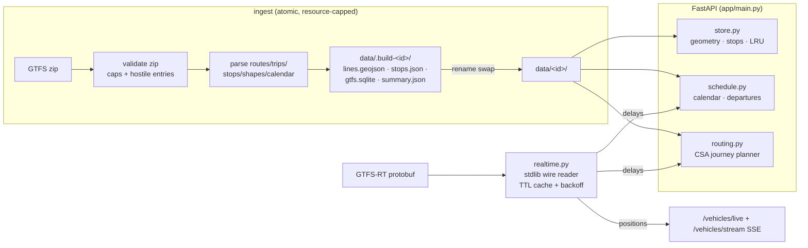

# Architecture

## Design principles

1. **Zero external services.** FastAPI + Uvicorn are the only runtime
   dependencies. Ingest, the CSA router and the GTFS-RT protobuf reader are
   pure stdlib. Anyone can run the whole thing with `pip install` + one
   command — that constraint shapes everything below.
2. **Artifacts over databases.** Each city compiles to three flat files that
   are cheap to serve and trivial to reason about.
3. **Degrade, don't fail.** Realtime outages fall back to static schedules;
   a bad feed can't take the process down; a failed ingest can't corrupt a
   serving one.

## Data flow

## Module map

| Module | Responsibility | Key decisions |
|---|---|---|
| `app/registry.py` | Merge curated `feeds.json` + generated `feeds_world.json` | curated wins on id collision |
| `app/ingest.py` | GTFS zip → artifacts | atomic build-and-swap; size/row caps; timezone captured from `agency.txt` |
| `app/store.py` | Serve geometry/stops | LRU-cached; **the** seam to replace with PostGIS |
| `app/schedule.py` | Service calendars, departure boards | GTFS times are local wall-clock; `24:xx+` handled via day offsets |
| `app/routing.py` | Connection Scan Algorithm A→B | delays shift connections **before** the scan; graph pre-warmed into RAM at startup |
| `app/realtime.py` | GTFS-RT vehicles + trip delays | hand-rolled protobuf wire reader; 4 s TTL, 30 s failure backoff, ≤60 s stale serving |
| `app/main.py` | HTTP surface | RFC 7807 errors, rate limiting, metrics, SSE, admin-gated ingest with job tracking |

## Concurrency & state

Single-process by design: hot caches (LRU/TTL), rate-limit windows, metrics
counters and the ingest-job registry live in process memory. Ingest runs on
FastAPI background tasks, reserved atomically under a lock, max 2 at once.
For multi-worker or multi-node deployments, move the shared state to Redis
and ingest to a worker queue — the seams are `store.py` (data), `_hits` /
`_ingest_jobs` (state) and `_do_ingest` (queue).

## Roadmap (from the external review)

- Per-feed **versioned artifacts** (`data/<id>/versions/<ts>/` + `current`
  symlink) with checksums, ETag-aware refresh and rollback.
- Ingest job queue with granular states (`downloading → parsing → swapping`),
  idempotency keys and retries.
- Differential routing tests against OpenTripPlanner on shared fixtures.
- Public benchmarks (`benchmarks/`) with p50/p95 latency history and SLOs.
- OpenTelemetry traces + per-stage ingest metrics.
